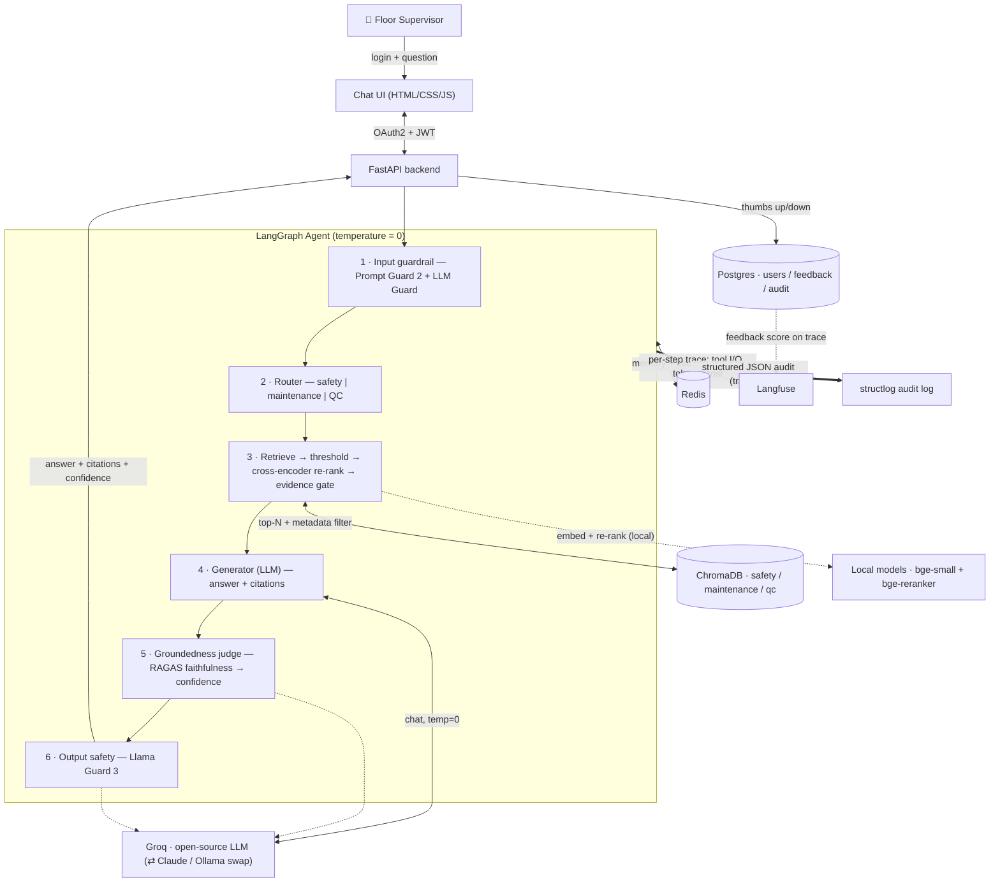
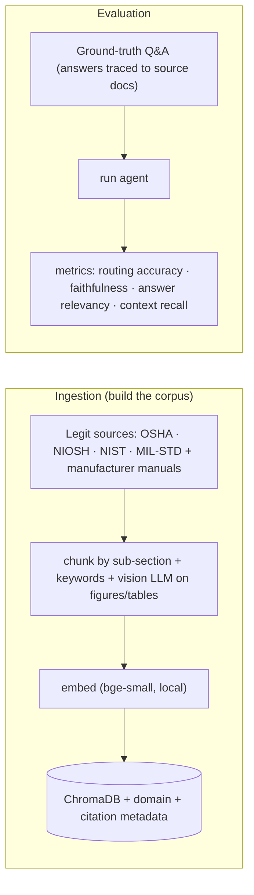

# Architecture — Manufacturing Floor Assistant

> Agentic RAG chatbot that lets floor supervisors ask questions in plain language and get
> **accurate, source-grounded answers with citations and a confidence score**, routed to the right
> documentation domain (Safety / Maintenance / Quality Control).
> Status: **approved 2026-07-11.** Build order: frontend first (UI experimentation), then backend, then wiring.

## 1. The problem (from the challenge brief)
Floor supervisors currently hunt through safety procedures, maintenance manuals, and QC standards
by hand. We build a chatbot that (a) **routes** each question to the correct documentation source,
(b) **answers grounded** in the real documents with **precise citations**, (c) **refuses to fabricate**
and reports a **confidence score**, and (d) is safe, observable, and auditable.

## 2. Stack decisions (grounded by research — sources at bottom)

| Concern | Choice | Why (short) |
|---|---|---|
| Chat LLM (generation, router, groundedness judge) | **Groq (GroqCloud)** open-source model — `llama-3.3-70b-versatile` or `llama-3.1-8b-instant`, **temperature=0**, via user's key | User has a "grok" key + wants open-source models with usage limits → this is **Groq**, which hosts open models. ⚠️ free tier is rate-limited — mitigate with Redis caching + minimal LLM calls. |
| Embeddings | **Local, in-process** — `BAAI/bge-small-en-v1.5` (fastembed / sentence-transformers) | Groq has **no embeddings API** (inference-only). Local embeddings are free, fast, and unthrottled on the hot retrieval path. |
| Re-ranker | **Local cross-encoder** — `BAAI/bge-reranker-base` | Second-stage relevance scoring so pulled context is *confidently* on-topic (per feedback). Local = no API limit. |
| Provider abstraction | Groq default; **Portkey→Claude Sonnet 4.5** and **Ollama** as config swaps | All OpenAI-compatible; one config switch. Groq is the default per user; Claude available as HQ/online fallback. |
| Orchestration | **LangGraph** | Explicit graph = per-step routing, guardrails, citations, and audit are first-class. |
| Vector DB | **ChromaDB** | Lightweight, local, metadata filtering per doc domain; stores citation metadata. |
| Memory / cache | **Redis** | Conversation memory + LLM/response cache (also softens Groq rate limits). |
| Input guardrails | **Llama Prompt Guard 2** (86M) on Groq — returns injection probability, block ≥ 0.5 | Injection / jailbreak gate; runs before routing so blocked inputs skip all other calls. |
| Groundedness | **Custom LLM-as-judge** on Groq (fast model) — **advisory** | Verifies answer is supported by retrieved context; feeds the confidence score. (RAGAS is the productionization path; a custom judge avoids its Ollama-oriented timeout issues.) |
| Output safety | **gpt-oss-safeguard-20b** on Groq (policy-prompted SAFE/UNSAFE) | Safety classification on the response; Llama Guard 3 isn't hosted on Groq, so this is the equivalent. |
| Observability | **Langfuse** (LangChain `CallbackHandler`) | Per-step tool I/O, tokens, cost, latency, + user-feedback scores on the trace. |
| Explainability logs | **structlog** JSON, keyed by Langfuse `trace_id` | Durable, queryable audit copy of every agent decision + tool I/O. |
| App datastore | **Postgres** (users, feedback, audit) | Reuses the Postgres Langfuse needs; avoids SQLite concurrency issues in Docker. |
| Frontend | **FastAPI** + HTML/CSS/JS chat UI, thumbs up/down, citations + confidence shown | Clean, non-technical; server-rendered + fetch to `/chat`. |
| Auth | **OAuth2 password flow + JWT**, hashed passwords, `supervisor` role | Standard FastAPI pattern; controls access & login. |
| Deployment | **Docker Compose** (app, chromadb, redis, langfuse+db) | One `docker compose up`, local. Groq is a remote API; embeddings/reranker run in-process. |
| Evaluation | **Ground-truth Q&A dataset** + RAGAS + routing accuracy | Expected answers traced to actual source docs, never invented. |

> ⚠️ **Open item:** the Groq API key was **not found** in this machine's env or shell profiles. Need the
> exact env var name (e.g. `GROQ_API_KEY`) before wiring generation. Value stays in env — never in code.

## 3. Retrieval & citation design (per feedback: thresholds, re-ranking, references, confidence)

Two-stage retrieval so context is *confidently* relevant, not just nearest-neighbor:

1. **Vector search** — embed query locally, pull top-N (N≈20) from ChromaDB, filtered to the routed
   domain, keeping only hits above a **cosine-similarity floor** (drops obviously-irrelevant chunks).
2. **Cross-encoder re-rank** — re-score the N candidates against the query with `bge-reranker-base`,
   keep top-k (k≈4) above a **rerank-score threshold**.
3. **Evidence gate** — if nothing clears the rerank threshold → respond *"I don't have confident
   evidence for that"* rather than answer weakly. (Ties into the groundedness judge.)

### Chunking & ingestion strategy (per feedback)

- **Chunk by sub-section**, not fixed token windows — split on document structure (headings /
  numbered sub-sections) so each chunk is a coherent, self-contained unit. Preserves the
  "answer lives in one procedure/clause" property that regulatory + manual content has.
- **Keyword metadata for hybrid search** — each chunk stores extracted keywords/entities
  (equipment names, standard numbers, hazard terms) alongside the vector, enabling **hybrid
  retrieval** (keyword/BM25 + dense vector) so exact terms like "1910.147" or "arc flash" match
  reliably, not just semantically.
- **Figures / tables / images** — extract them during ingestion; use a **vision-capable LLM**
  (Groq Llama 4 / Llama-3.2-Vision — confirm availability at build) to generate a text
  interpretation of each figure/table, stored as chunk text + metadata so image content is
  retrievable and citable. Tables are also captured in a structured form where feasible.
  ⚠️ Verify which vision model is live on Groq before committing to this in the ingestion build.

**Citations:** at ingestion every chunk carries metadata — `source_title`, `section`/heading,
`page`, `chunk_id`, `url`, `keywords`, and (for visual chunks) `figure_ref`. Every answer returns
inline references to the exact source location it used.

**Confidence score (shown with the references):** a composite, defined explicitly so it's meaningful:

```
confidence = normalize(top rerank score)  ×  groundedness (RAGAS faithfulness)
           → displayed as High / Medium / Low + a %, next to the citations
```

So a confident answer means: the supporting chunks scored high on the cross-encoder **and** the
generated answer was judged faithful to those chunks. Low on either → lower confidence, surfaced to
the supervisor rather than hidden.

## 4. Runtime request flow



## 5. Offline pipelines



## 6. Data corpus (all real, sourced; legal status noted)

**Currently ingested (628 chunks):**
- **Safety (public domain — US gov):** OSHA 3120 (Lockout/Tagout), OSHA 3170 (machine guarding).
- **Quality Control (public domain — US gov):** NIST/SEMATECH e-Handbook — Process/Product Monitoring & Control (SPC).
- **Maintenance (real manufacturer manual — internal-prototype only, NOT for redistribution):** Baldor-Reliance MN416 (AC/DC motor installation & maintenance).

**Ready to add (verified sources in research):** NIOSH 2007-131 (ergonomics), MIL-STD-1916 (acceptance sampling), Grundfos Pump Handbook.
**Cite-only (do not ingest):** NFPA 70E, ISO 9001 (paywalled / read-only).

> ⚠️ The maintenance doc is a real manufacturer PDF: free to download, copyright retained.
> Approved for **internal prototype use**; public redistribution would need manufacturer permission.
> Source URLs shift — the Goulds pump URL from research 404'd at build time, so we used the Baldor
> motor manual instead (verified live). Licensing is tracked per source in `app/backend/sources.py`.

## 7. Definition of done for this build
Routing is measured against a labeled set; answers are graded for faithfulness against retrieved
context; every answer carries citations + a confidence score; the app runs via `docker compose up`;
missing config (incl. the Groq key) fails fast; secrets only via env vars.

## 8. Sources (grounding)
- Groq hosts open-source models, cloud-only, **no embeddings API** (inference-only): groq.com/groqcloud, decodingdatascience.com/groq-api-2026-complete-guide · Llama Guard on Groq: console.groq.com/docs
- Local embeddings/rerank: BAAI bge-small-en-v1.5 + bge-reranker (huggingface.co/BAAI), fastembed (github.com/qdrant/fastembed)
- Grok (xAI) proprietary / no embeddings: x.ai/api, promptfoo.dev/docs/providers/xai
- Portkey→Claude Sonnet 4.5 (config-swap option): portkey.ai/docs/integrations/llms/anthropic
- LangGraph + provider temperature=0: docs.langchain.com/oss/python/integrations/chat
- Guardrails: Meta Prompt Guard 2 / LlamaFirewall (arXiv 2505.03574), LLM Guard (github.com/protectai/llm-guard), Llama Guard 3
- Groundedness: RAGAS faithfulness (docs.ragas.io) — run async/advisory
- Langfuse ↔ LangGraph: langfuse.com/integrations/frameworks/langchain
- Data: osha.gov publications, cdc.gov/niosh, itl.nist.gov/div898/handbook, everyspec.com (MIL-STD-1916), manufacturer domains (gouldspumps.com, baldor.com)
```
